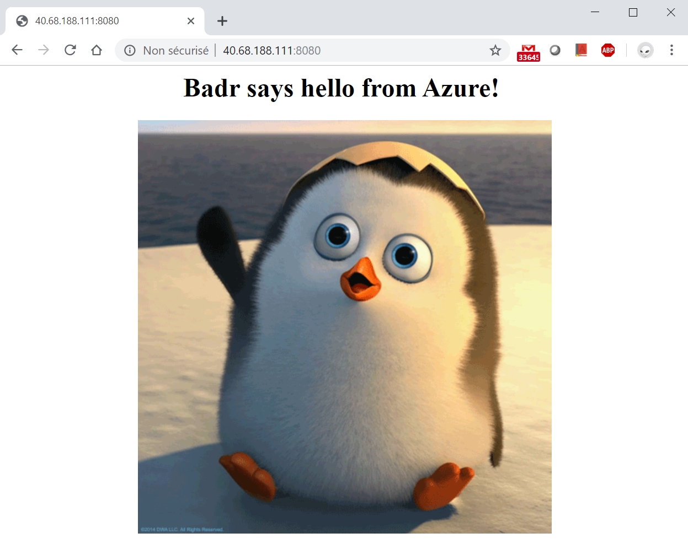

# Building resources on Azure with Terraform
## building a VM with nginx server and a customized web page

In this project I will be using terraform to setup an infrastructure in Azure to host a VM with nginx web server serving
a custom web page on port 8080.

# Terraform infrastructure as code

The code includes 3 terraform files:

`provider.tf` specifies that terraform has to use Azure as a cloud provider to build the resources via (Azure Resource Manager). I have included comments in the file for more understanding.

`var.tf` contains variables declaration that I will be calling in the code. 

`resources.tf` is where I declare all the resources terraform should create in Azure when applying the code. Comments are available
in the code for better understanding.

`output.tf` specifies the value I want to print out after the completion of the build, the public IP of the instance in this case.

# Installing nginx and the custom web page

This is something I will be doing while building the VM instance. In fact cloud providers like Azure, AWS and GCP make it
possible to run startup scripts that run while creating the instance. Shell scripts can then be used to install packages and
make some changes in the configuration. 

In this project I will be using script `script.sh` to install nginx and change its default listening port to 8080 then
change the default index.html to a customized one.

One special thing about using startup scripts in Azure is that it is required to encode the script in base64. There are
plenty of tools that perform this, for test purpose I will use the online encoder https://www.base64encode.org/

# Build the infrastructure with Terraform 

First thing to do is to initialize the working directory where terraform code is located with the command `terraform init`,
this will enable terraform to prepare the directory as a terraform workspace and get the necessary plugins to talk with the cloud provider, for my case
the azurerm plugin. 

Next thing is to verify the syntax with `terraform validate`, this is a good step to do in order to check if the code is
well written. Although I am using IntelliJ IDE which has the official terraform plugin from Hashicorp that provides
auto-complete and performs syntax check, I still use terraform validation as a double check.

One optional step to do before running the code is `terraform plane`, this gives an idea about what the code will do
without really applying it against the cloud provider. This step helps prevent and rework the code for any unwanted
results.

Last step is to go ahead and run `terraform apply` and issue a `yes` when prompted and Voila! Terraform will do its magic
and outputs the public ip of the created instance!

# Test the results

after terraform finishes the work, I copy the printed out public IP X.X.X.X and access http://X.X.X.X:8080
and as expected it shows my custom web page!

One more thing, If I want to remove all the resources from Azure, it as simple as running the command `terraform destroy`
this will exactly do the opposite of `terraform apply` and remove everything I have built.

